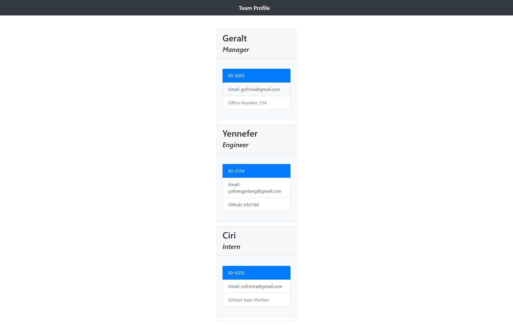

Tom Barber - Team Profile Generator

Description: In the workplace, one can find themselves with the responsibility of managing a sizeable group of people. In situations like this, it can be useful to have one place where all of the relevant information about each employee is readily available.  To help with this need, I've developed an app that will allow employeers to create profiles for each person on their team.  This app uses node.js to have employeers create groups of interns, managers and engineers by filling out their imformation by providing some basic information.  Currently there are three classes of employee availabe to be grouped together.  The first improvement I would make in the future is to allow more classes to be used.

License:

Copyright (c) [2021] [Tom Barber]

Permission is hereby granted, free of charge, to any person obtaining a copy of this software and associated documentation files (the "Software"), to deal in the Software without restriction, including without limitation the rights to use, copy, modify, merge, publish, distribute, sublicense, and/or sell copies of the Software, and to permit persons to whom the Software is furnished to do so, subject to the following conditions:

The above copyright notice and this permission notice shall be included in all copies or substantial portions of the Software.

THE SOFTWARE IS PROVIDED "AS IS", WITHOUT WARRANTY OF ANY KIND, EXPRESS OR IMPLIED, INCLUDING BUT NOT LIMITED TO THE WARRANTIES OF MERCHANTABILITY, FITNESS FOR A PARTICULAR PURPOSE AND NONINFRINGEMENT. IN NO EVENT SHALL THE AUTHORS OR COPYRIGHT HOLDERS BE LIABLE FOR ANY CLAIM, DAMAGES OR OTHER LIABILITY, WHETHER IN AN ACTION OF CONTRACT, TORT OR OTHERWISE, ARISING FROM, OUT OF OR IN CONNECTION WITH THE SOFTWARE OR THE USE OR OTHER DEALINGS IN THE SOFTWARE